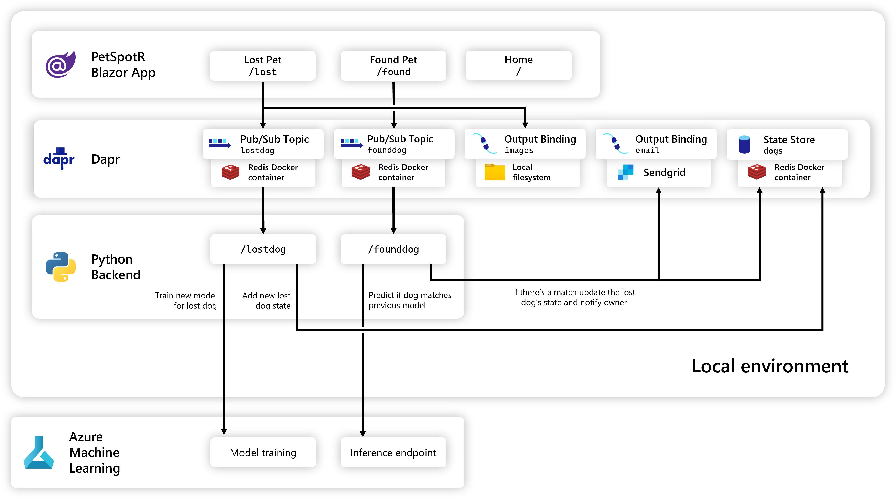
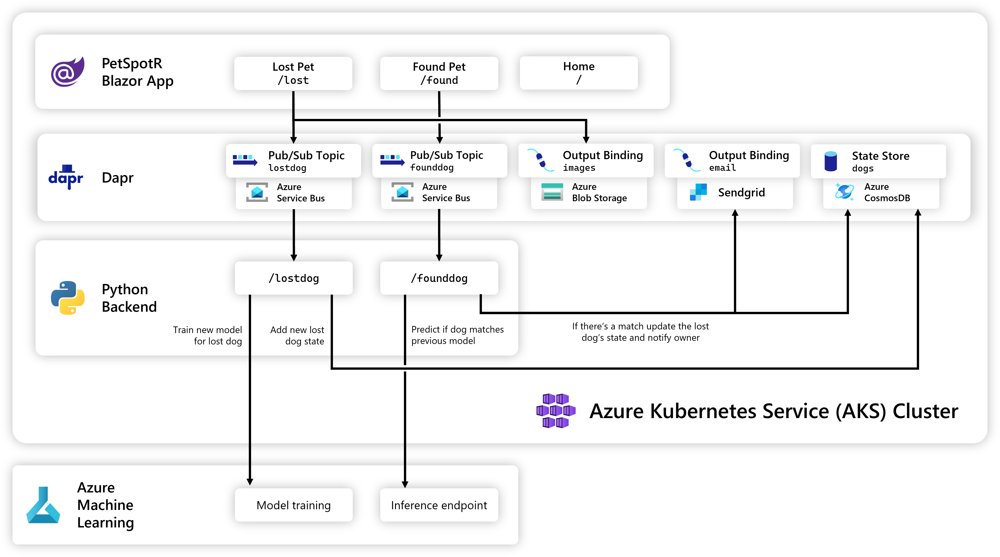

# PetSpotR

PetSpotR allows you to use advanced AI models to report and find lost pets. It is a sample application that uses Azure Machine Learning to train a model to detect pets in images.

It also leverages popular open-source projects such as Dapr and Keda to provide a scalable and resilient architecture.


## Build 2023 Lab Session

Welcome to the Build 2023 lab session for PetSpotR! This lab will walk you through a set of exercises to run, deploy, and scale PetSpotR.

[**🚀 Lab instructions**](./docs/lab.md)

## Featured technologies

- [Bicep](https://docs.microsoft.com/en-us/azure/azure-resource-manager/bicep/overview) - Infrastructure as code
- [Bicep extensibility Kubernetes provider](https://learn.microsoft.com/en-us/azure/azure-resource-manager/bicep/bicep-extensibility-kubernetes-provider) - Model Kubernetes resources in Bicep
- [Azure Kubernetes Service](https://docs.microsoft.com/en-us/azure/aks/intro-kubernetes)
- [Azure Blob Storage](https://docs.microsoft.com/en-us/azure/storage/blobs/storage-blobs-introduction)
- [Azure Cosmos DB](https://docs.microsoft.com/en-us/azure/cosmos-db/introduction)
- [Azure Service Bus](https://docs.microsoft.com/en-us/azure/service-bus-messaging/service-bus-messaging-overview)
- [Azure Machine Learning](https://learn.microsoft.com/en-us/azure/machine-learning/overview-what-is-azure-machine-learning)
- [Hugging Face](https://huggingface.co) - AI model community
- [Azure Load Testing](https://docs.microsoft.com/en-us/azure/load-testing/) - Application load testing
- [Blazor](https://dotnet.microsoft.com/apps/aspnet/web-apps/blazor) - Frontend web application
- [Python Flask](https://pypi.org/project/Flask/) - Backend server
- [Dapr](https://dapr.io) - Microservice building blocks
- [KEDA](https://keda.sh) - Kubernetes event-driven autoscaling

## Architecture

> **Note**: This application is a demo app which is not intended to be used in production. It is intended to demonstrate how to use Azure Machine Learning and other Azure services to build a scalable and resilient application. Use at your own risk.

### Local architecture



### Cloud architecture

Moving from local to cloud is as simple as swapping out the local Dapr components with their cloud equivalents:



### Microservices

PetSpotR is a microservices application that uses [Azure Machine Learning](https://learn.microsoft.com/en-us/azure/machine-learning/overview-what-is-azure-machine-learning) to train a model to detect pets in images. It also uses Azure Blob Storage to store images and Azure Cosmos DB to store metadata, leveraging [Dapr](https://dapr.io) bindings and state management to abstract away the underlying infrastructure.

The frontend is a [.NET Blazor application](https://learn.microsoft.com/en-us/aspnet/core/blazor/?view=aspnetcore-7.0) that allows users to upload images and view the results. The backend is a [Python Flask application](https://pypi.org/project/Flask/) that uses Azure Machine Learning to train and score the model.

### AI model training

The application uses [Azure Machine Learning](https://learn.microsoft.com/en-us/azure/machine-learning/overview-what-is-azure-machine-learning) to train a model to detect pets in images. The model is sourced via [Hugging Face](https://huggingface.co), which is a community of AI researchers and developers. The model is trained using the [Azure Machine Learning Compute Instance](https://docs.microsoft.com/en-us/azure/machine-learning/concept-compute-instance), which is a managed compute environment for data scientists and AI developers.

### State management

The application uses the [Dapr](https://dapr.io) state management API to abstract away the underlying infrastructure. When the application is running locally, the state is stored in a lightweight Redis container. When the application is running in the cloud, the state is stored in Azure Cosmos DB.

### Publish & subscribe messaging

The application uses the [Dapr](https://dapr.io) pub/sub API to abstract away the underlying infrastructure. When the application is running locally, the messages are sent via a lightweight Redis container. When the application is running in the cloud, the messages are sent via Azure Service Bus.

### Bindings

The application uses the [Dapr](https://dapr.io) bindings API to abstract away the underlying infrastructure. When the application is running locally, the images are stored in the local filesystem. When the application is running in the cloud, the bindings are stored in Azure Blob Storage.

### Scaling

The application scales using [KEDA](https://keda.sh), which allows you to scale based on the number of messages in a queue. The application uses Azure Service Bus to queue messages for the backend to process, leveraging [Dapr](https://dapr.io) pub/sub to abstract away the underlying infrastructure.

### Load testing

[Azure Load Testing](https://learn.microsoft.com/en-us/azure/load-testing/overview-what-is-azure-load-testing) is used to simulate a large number of users uploading images to the application, which allows us to test the application's scalability.

## Running PetSpotR

### Prerequisites

- [Azure subscription](https://azure.microsoft.com/free/)
  - **Note**: This application will create Azure resources that <font color=red>**will incur costs**</font>. You will also need to manually request quota for `Standard NCSv3 Family Cluster Dedicated vCPUs` for Azure ML workspaces, as the default quota is 0.
- [Azure CLI](https://docs.microsoft.com/cli/azure/install-azure-cli)
- [Dapr CLI](https://docs.dapr.io/getting-started/install-dapr-cli/)
- [Helm](https://helm.sh/docs/intro/install/)
- [Docker](https://docs.docker.com/get-docker/)
- [Python 3.8](https://www.python.org/downloads/)
- [Dotnet SDK](https://dotnet.microsoft.com/download/dotnet/)
- [Bicep extensibility](https://learn.microsoft.com/en-us/azure/azure-resource-manager/bicep/bicep-extensibility-kubernetes-provider#enable-the-preview-feature)

### Run in a Codespace

You can run this application in a [GitHub Codespace](https://docs.github.com/en/codespaces/developing-in-codespaces/creating-a-codespace). This is useful for development and testing. The ML training and scoring will run within an Azure Machine Learning workspace in your Azure subscription.

1. Click the `Code` button and select `Open with Codespaces`
1. Wait for the Codespace to be created
1. Hit 'F5' or open the `Run and Debug` tab and select `✅ Debug with Dapr`

### Run locally

The services in this application can be run locally using the Dapr CLI. This is useful for development and testing. The ML training and scoring will run within an Azure Machine Learning workspace in your Azure subscription.

1. Install the [Dapr CLI](https://docs.dapr.io/getting-started/install-dapr-cli/)
1. Initialize Dapr
   ```bash
   dapr init
   ```
1. Configure your Dapr images component for Windows or Mac
   1. Open ./iac/dapr/local/images.yaml
   1. Uncomment the appropriate section for your OS, and comment out the other section
1. Deploy the required Azure resources
   ```bash
   az deployment group create --resource-group myrg --template-file ./iac/infra.bicep --parameters mode=dev
   ```
1. Run the backend
   ```bash
   cd src/backend
   dapr run --app-id backend --app-port 6002 --components-path ../../iac/dapr/local -- python app.py
   ```
1. Run the frontend
   ```bash
   cd src/frontend/PetSpotR
   dapr run --app-id frontend --app-port 5114 --components-path ../../../iac/dapr/local -- dotnet watch
   ```
1. Navigate to http://localhost:5114

### Deploy to Azure with the CLI

1. Ensure you have access to an Azure subscription and the Azure CLI installed
   ```bash
   az login
   az account set --subscription "My Subscription"
   ```
1. Clone this repository
   ```bash
   git clone https://github.com/azure-samples/petspotr.git
   cd petspotr
   ```
1. Deploy the infrastructure
   ```bash
   az deployment group deployment create --resource-group myrg --template-file ./iac/infra.json
   ```
1. Deploy the configuration
   ```bash
   az deployment group deployment create --resource-group myrg --template-file ./iac/config.json
   ```
1. Get AKS credentials
   ```bash
   az aks get-credentials --resource-group myrg --name petspotr
   ```
1. Install Helm Charts
   ```bash
   helm repo add dapr https://dapr.github.io/helm-charts/
   helm repo add kedacore https://kedacore.github.io/charts
   helm repo update
   helm upgrade dapr dapr/dapr --install --version=1.10 --namespace dapr-system --create-namespace --wait
   helm upgrade keda kedacore/keda --install --version=2.9.4 --namespace keda --create-namespace --wait
   ```
1. Log into Azure Container Registry
   You can get your registry name from your resource group in the Azure Portal
   ```bash
   az acr login --name myacr
   ```
1. Build and push containers
   ```bash
   docker build -t myacr.azurecr.io/backend:latest ./src/backend
   docker build -t myacr.azurecr.io/frontend:latest ./src/frontend
   docker push myacr.azurecr.io/petspotr:latest
   docker push myacr.azurecr.io/frontend:latest
   ```
1. Deploy the application
   ```bash
   az deployment group deployment create --resource-group myrg --template-file ./iac/app.json
   ```
1. Get your frontend URL
   ```bash
   kubectl get svc
   ```
1. Navigate to your frontend URL
