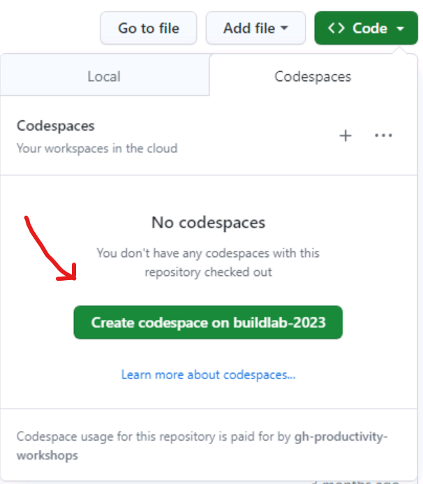
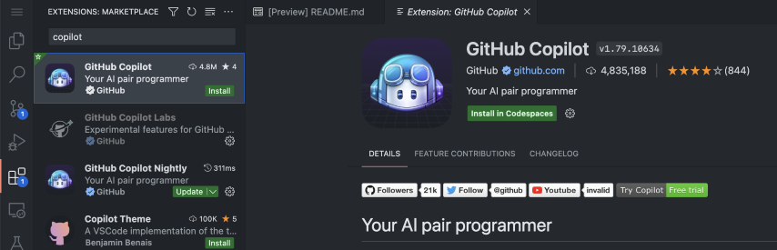
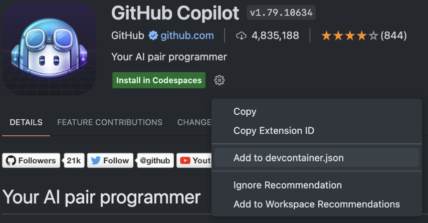
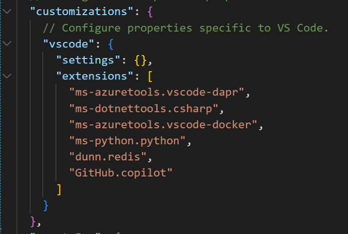
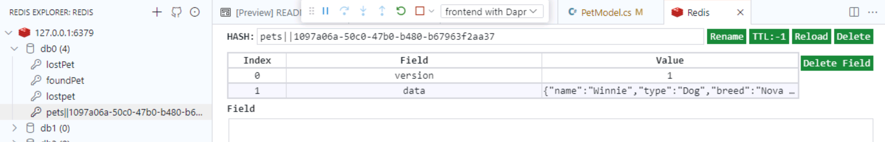
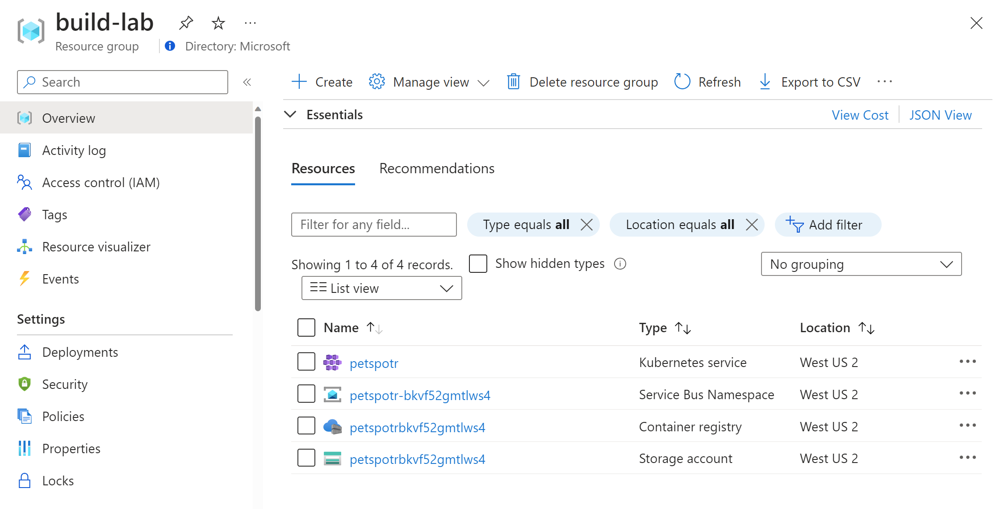
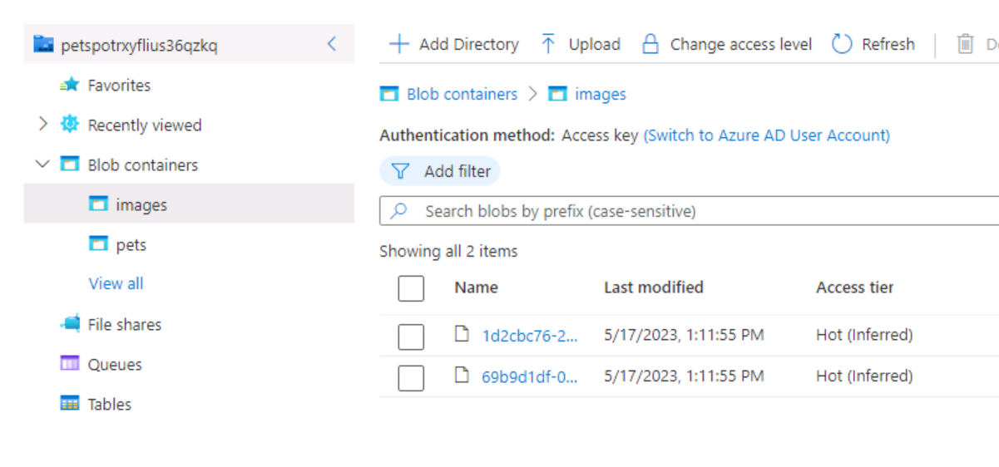
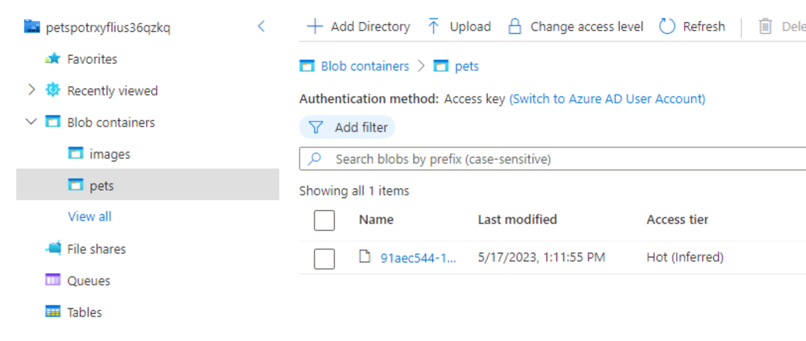

# Welcome to the PetSpotR Build Lab

This guide will walk you through a set of exercises to run, deploy, and scale PetSpotR.

As part of this lab, you will:

1. Launch a GitHub Codespace with the PetSpotR repository
1. Customize your Codespace and rebuild it instantly
1. Run PetSpotR locally
1. Use GitHub Copilot to improve the application by adding in Dapr
1. Create a Bicep template and deploy the application to Azure
1. Use KEDA to scale the application to handle increased load

## Getting started

Welcome to the lab!

Begin by logging in with your VM password:

@lab.VirtualMachine(BuildBaseVM).Password

## Exercise 1: Run PetSpotR in a GitHub Codespace

Cloud computing has exploded in the past few decades. But the cloud can be used for more than just running production workloads - it can host your development environments as well!

[GitHub Codespaces](https://github.com/features/codespaces) allow you to code from almost anywhere in the world, giving you Visual Studio Code backed by high performance VMs that start in seconds and can be customized to perfectly suit the code you're working on.

The advantages of using Codespaces over local development are many. You can standardize on a set of dependencies for a project, onboard a new developer in seconds rather than days, and spin up and tear down context-aware Codespaces at a moment's notice.

🤯 _Fun Fact: GitHub itself uses Codespaces to develop GitHub! New engineers can go from zero to ready to code in about 10 seconds. And that's on an 11GB codebase!_

Your first task is to launch a GitHub Codespace, customize it, and then launch PetSpotR within it.

### 1.1 Launch a GitHub Codespace

You'll begin by launching a new GitHub Codespace. This will give you a pre-configured environment with all the tools you need to run PetSpotR.

1. Navigate to the [PetSpotR GitHub repository](https://github.com/Azure-Samples/PetSpotR/tree/build-2023-lab), and make sure you are on the `build-2023-lab` branch
2. Sign into GitHub with your GitHub account
3. Click the `<> Code` button and select the `Codespaces` tab
   
4. Click the `+` button to launch a new Codespace on the `build-2023-lab` branch
   - If you're unable to launch a Codespace please talk to a lab assistant. We'll need to add you to the org so we can bill the Codespace to the lab.

You should now drop directly into a Codespace with the PetSpotR repository cloned and ready to go.

### 1.2 Explore the Codespace

1. In the Codespace terminal, run `ls -1 -a` to list the files in the repository:
    
    ```bash
    $ ls -1 -a
    ```
    > Note: The `-1` flag will list the files one per line, and the `-a` flag will list all files, including hidden files.

    You should see the following files:

    ```
    .
    ..
    .devcontainer
    docs
    .git
    .github
    .gitignore
    iac
    img
    LICENSE
    README.md
    src
    tests
    .vscode
    ```

    Important directories to note are:

    - `.devcontainer` contains the configuration for this Codespace environment.
    - `docs` contains the documentation for the application, including this lab guide.
    - `iac`  contains the Bicep infrastructure as code (IaC) for the application. We'll revisit this directory later in the lab.
    - `src`  contains the source code for the application's backend and frontend services.
    - `.vscode` contains the configuration for both the Codespace and Visual Studio Code.

2. Your Codespace also can run Docker containers inside of it! Run `docker ps` to list the running containers:
    
    ```bash
    docker ps
    ```

    You should see the following containers:

    ```
    CONTAINER ID   IMAGE                COMMAND                 ...
    57e30aa3124c   openzipkin/zipkin    "start-zipkin"          ...
    570e831d9299   daprio/dapr:1.10.5   "./placement"           ...
    ff778032cc52   redis:6              "docker-entrypoint.s…"  ...
    ```

    These are the default Dapr containers for Zipkin, Dapr placement service, running in the Codespace. They will be used when you run PetSpotR locally later on.
3. Let's take a look at how to customize your Codespace. Open `.devcontainer/devcontainer.json` to see the Codespace definition:

   ```bash
   code .devcontainer/devcontainer.json
   ```

   You'll notice some important properties:
   
   - `image` - The Docker image used to create the Codespace
   - `onCreateCommand` - The command to run when the Codespace is created, which can be used to install dependencies or other setup tasks
   - `features` - A list of [features](https://github.com/devcontainers/features) to install in the Codespace, such as Python support, the Azure CLI, or Docker-in-Docker support
   - `customizations.vscode.extensions` - A list of Visual Studio Code extensions to install in the Codespace

### 1.3 Customize your Codespace

Now that you're up and running with your Codespace, let's get ready to use GitHub Copilot!

Let's add the GitHub Copilot extension, but let's add it to the devcontainer rather than just install it.

1. Open the "Extensions" () pane
2. Search for "Copilot" and select the GitHub Copilot extension

3. Don't click the green "Install in Codespaces" button! Instead, click the cog icon (⚙️) and select "Add to devcontainer.json".

4. Go back to the `devcontainer.json` file and see the change. Note that the extension hasn't been installed in your Codespace at this point.


To see the change, we'll need to rebuild our Codespace.

6. Using your keyboard, press `Ctrl/Cmd-Shift-P`, then type "rebuild" to find the "Codespaces: Rebuild Container" option. Select it and press Enter, or click it with the mouse.

7. Confirm your choice by clicking "Rebuild" and wait for your Codespace to reload.

 _This may take a little longer than your first build! This is because we're taking advantage of a feature called Prebuilds. Your instructor will show you how to set these up and explain why they're useful._
8. Once reloaded, you'll be able to see GitHub Copilot installed - both in the Extensions pane, as well as via the GitHub Copilot logo at the bottom right of the status bar!

   

### 1.4 Run PetSpotR locally

Now that you are familiar with the Codespace, you can run PetSpotR locally.

1. Open `.vscode/launch.json` to see the launch configurations for the Codespace. You'll use these to run PetSpotR locally:

    ```bash
    code .vscode/launch.json
    ```

    You should see launch configurations for:

    - `frontend with Dapr` - Launches the frontend service with Dapr
    - `backend with Dapr` - Launches the backend service with Dapr

    You'll also see a compound launch configuration called `✅ Debug with Dapr` that will launch both the frontend and backend services with Dapr.

1. Select the `Run and Debug` () tab in the left-hand pane of the Codespace.
2. Make sure the launch configuration is set to `✅ Debug with Dapr`
3. Click the `Start Debugging` button (▶️) to launch PetSpotR locally

You'll now see the PetSpotR application launch in a new browser tab. You can use this application to explore the functionality of PetSpotR.

### 1.5 Explore PetSpotR

You can now explore the PetSpotR application which is running in your Codespace.

> **Note**: Codespaces automatically forwards local ports and makes them available in the browser. The URL which was automatically opened uses `...app.github.dev` to connect you to your Codespace. You can also use the `PORTS` tab in the Codespace to find the port that was forwarded to the application.

1. Visit the `Lost` and `Found` pages to see the application's interface. Dapr has not been added to the application yet, so you'll see errors in the browser console if you try to fill out the form.
2. Return to your Codespace and take a look at your frontend logs. You'll see print statements for the `Lost` and `Found` pages, where calls to Dapr need to be added.
3. Stop the debuggers by clicking the `Stop Debugging` button (⏹️) in the top debug bar. You'll need to stop both the frontend and backend debuggers.

Done! You now have a Codespace with PetSpotR running locally. You can now use GitHub Copilot to add Dapr to the application.

_The instructor will now demonstrate how to use GitHub Copilot to add Dapr to the application. You can wait to follow along, or you can continue with the exercises below._

## Exercise 2: Use GitHub Copilot to add Dapr to the frontend

2023 saw an explosion of artificially intelligent (AI) tools into the mainstream, promising increased productivity and removing busywork. [GitHub Copilot](https://github.com/features/copilot) is your AI pair programmer and was one of the first commercially-available tools based on Large Language Models (LLMs). First released as a technical preview in June 2021, it was made generally available to individuals one year later in June 2022.

GitHub Copilot can suggest code and entire functions to help you code faster, focus on business logic over boilerplate, and be a happier and more productive developer!

Your next task is to use GitHub Copilot to add Dapr to the PetSpotR application.

⚠️ _NOTE: GitHub Copilot is non-deterministic! It syntheses code just for you, so you will likely see different suggestions than the person next to you! We'll talk about how to get the best out of Copilot a little later._

### 2.1 Add Dapr to the frontend

1. Open `src\frontend\PetSpotR\Data\PetModel.cs` to open the Pet model:
    
    ```bash
    code ./src/frontend/PetSpotR/Data/PetModel.cs
    ```
2. Add a new comment underneath the `public PetModel()` constructor, which describes what you want to do, in natural language:
    
    ```csharp
    public PetModel(){...}

    // Save state to "pets" Dapr state store, using the supplied Dapr client
    ```
3. You'll now see GitHub Copilot suggest a new method to add to the Pet model. Hit `Tab` to accept the suggestion and add the method to the Pet model.

    > 🤔 _We refer to this suggestion mechanism as "ghost text". You can hit Tab to accept a suggestion, or simply ignore it and keep typing._

    You should see something like this (_your results might slightly differ as Copilot can be non-deterministic_):

    ```csharp
    // Save state to "pets" Dapr state store, using the supplied Dapr client
    public async Task SavePetStateAsync(DaprClient daprClient)
    {
        await daprClient.SaveStateAsync("pets", ID, this);
    }
    ```
4. You'll now see a red squiggly line under the `SavePetStateAsync` method. This is because the Dapr.Client NuGet package needs to be added to the project. Click on the `DaprClientBuilder` method, click on the lightbulb, and select the `using Dapr.Client;` suggestion.
   
5. You'll notice that we're not using a try/catch block for this remote Dapr call. To add one, simply add a new line and type `try` and hit `Tab` to accept the suggestion. You'll now see a new try/catch block added to the method:

    

    _You may need to manually delete the old `await daprClient.SaveStateAsync("pets", ID, this);` line._

6. Repeat the above process to add a new method to publish the lost pet to the "lostPet" topic. Try the following comment:

    ```csharp
    // Publish a message to the lostPet Dapr pub/sub topic on the pubsub broker
    ```

    You should end up with the following method:

    ```csharp
    // Publish a message to the lostPet Dapr pub/sub topic on the pubsub broker
    public async Task PublishLostPetAsync(DaprClient daprClient)
        {
            try
            {
                await daprClient.PublishEventAsync(
                    pubsubName: "pubsub",
                    topicName: "lostPet",
                    data: new Dictionary<string, string>
                    {
                        { "petId", ID }
                    }
                );
            }
            catch
            {
                throw;
            }
 
        }
    ```
7. Select the `Run and Debug` () tab in the left-hand pane of the Codespace.
8. Make sure the launch configuration is set to `✅ Debug with Dapr`
9. Click the `Start Debugging` button (▶️) to launch PetSpotR locally
10. Visit the `Lost` and `Found` pages to see the application's interface. You'll see that the form now works, and you can add lost and found pets to the application.
11. In your Codespace open the Redis extension (), and add the default Redis connection, accepting the default values:
   
12. In `db0` you should now see your saved state, and in `lostPet` you should see your lost pet messages:
   

   ## TODO: Add a screenshot of the Redis data

Done! You've now just added Dapr into your application using Copilot.

_The instructor will now demonstrate how to use Bicep to model your infrastructure. You can wait to follow along, or you can continue with the exercises below._

## Exercise 3: Use Bicep to model your infrastructure as code

We're now ready to deploy PetSpotR to Azure. You'll use Bicep to model your infrastructure as code. Bicep is a domain-specific language (DSL) for describing and deploying Azure resources declaratively. You'll use Bicep to deploy PetSpotR to Azure.

### 3.1 Create a Bicep template for your images storage account

1. Open `iac/infra.bicep` to open the Bicep template for your infrastructure:

    ```bash
    code ./iac/infra.bicep
    ```

    Notice that the storage module has an error, because the file `storage.bicep` does not yet exist. Let's fix that!

2. Create a new file, `storage.bicep`, which will contain the definition of your storage account:

    ```bash
    code ./iac/infra/storage.bicep
    ```

3. Using Copilot, let's generate the parameters we need. Let's use comments as a starting point:

    ```bicep
    // Parameter for the location of the storage account

    // Parameter for the name of the storage account
    ```

    Copilot should generate the following parameters:

    ```bicep
    // Parameter for the location of the storage account
    param location string = resourceGroup().location

    // Parameter for the name of the storage account
    param storageAccountName string
    ```

4. We now need a new resource, `storageAccount`, which will be an Azure storage account. Use Copilot with comments for suggestions to generate the resource:

    ```bicep
    // Storage account for storing images
    ```

    Copliot should generate the following resource:

    ```bicep
    // Storage account for storing images
    resource storageAccount 'Microsoft.Storage/storageAccounts@2019-06-01' = {
      name: storageAccountName
      location: location
      kind: 'StorageV2'
      sku: {
        name: 'Standard_LRS'
      }
    }
    ```

5. To make the storage account available to other resources, you'll need to pass back the storage account's ID. Use another comment to have Copilot generate the output:

    ```bicep
    // Output for the storage account ID
    ```

    Copilot should generate the following output:

    ```bicep
    // Output for the storage account ID
    output storageAccountId string = storageAccount.id
    ```

### 3.2 Deploy your infrastructure to Azure

You're now ready to deploy your application to Azure. You'll use the Azure CLI to deploy your infrastructure:

1. Run `az login --use-device-code` to log in to Azure. You'll need to use a device code because you're running in a Codespace.
   - @lab.CloudPortalCredential(User1).Username
   - @lab.CloudPortalCredential(User1).Password

    _You can also click on the Resources tab to view these credentials._

2. Deploy your iBicep file using `az deployment create`

    ```bash
    az deployment create --location westus2 --template-file ./iac/infra.bicep
    ```
3. You can visit https://portal.azure.com to see the resources being deployed under your new `build-lab` resource group.
    

### 3.3 Configure your cluster

Now that you've deployed your infrastructure, you're ready to configure your cluster. You'll use the Dapr CLI to install Dapr.

1. Run `az aks get-credentials` to get the credentials for your AKS cluster:

    ```bash
    az aks get-credentials --resource-group build-lab --name petspotr
    ```

2. Run `dapr init -k` to install Dapr into your Kubernetes cluster:

    ```bash
    dapr init -k
    ```

Done! You now have Dapr installed on your AKS cluster.

### 3.4 Deploy Dapr cloud components

Now that you've installed Dapr on your cluster, you're ready to deploy the Dapr cloud components. When running PetSpotR locally, you used the Redis state store and pub/sub components. In Azure, you'll use an Azure Storage Account and Azure Service Bus.

1. Open `iac/dapr/azure/statestore.yaml` to open the YAML template for your Dapr state store component:

     ```bash
     code ./iac/dapr/azure/statestore.yaml
     ```

     You can also view images.yaml and pubsub.yaml.

2. Deploy these components using `kubectl apply`:

    ```bash
    kubectl apply -f ./iac/dapr/azure
    ```

3. Done! You've now added Dapr components to your cluster.

### 3.5 Deploy your application to Azure

You're now ready to deploy your application to Azure. You'll use the Azure CLI to deploy your application:

1. Open `iac/app.bicep` to open the Bicep template for your application:

    ```bash
    code ./iac/app.bicep
    ```

    Notice the use of modules for the frontend, backend, ingress, and secrets.

2. Open `iac/app/frontend.bicep` to see a set of Kubernetes resources. That's right, Bicep does Kubernetes!

    ```bash
    code ./iac/app/frontend.bicep
    ```

3. Deploy your application using `az deployment create`

    ```bash
    az deployment group create --resource-group "build-lab" --template-file ./iac/app.bicep
    ```

### 3.6 Access the PetSpotR application

Now that you've deployed your infrastructure and application you're ready to access the PetSpotR application!

1. Get the hostname of your HTTP ingress:

    ```bash
    kubectl get ingress
    ```

1. Try out the application by reporting a lost pet
1. Open the storage account in the Azure portal and navigate to the `images` container. You should see the image you uploaded:
   
1. Open the 'pets' container in the storage account and you should see the pet you reported:
   

Done! You've now deployed PetSpotR to Azure using Bicep and used cloud Dapr bindings to connect to Azure services.
