# Increasing Developer Productivity with GitHub Copilot and Codespaces

👋 Welcome!

In this workshop, you'll learn lots of exciting skills around two of our most popular features - GitHub Codespaces and GitHub Copilot.

## 👩‍💻 GitHub Codespaces

Cloud computing has exploded in the past few decades. But the cloud can be used for more than just running production workloads - it can host your development environments as well!

[GitHub Codespaces](https://github.com/features/codespaces) allow you to code from almost anywhere in the world, giving you Visual Studio Code backed by high performance VMs that start in seconds and can be customized to perfectly suit the code you're working on.

The advantages of using Codespaces over local development are many. You can standardize on a set of dependencies for a project, onboard a new developer in seconds rather than days, and spin up and tear down context-aware Codespaces at a moment's notice.

_ 🤯 Fun Fact: GitHub itself uses Codespaces to develop GitHub! New engineers can go from zero to ready to code in about 10 seconds. And that's on an 11GB codebase!_

 In this workshop you will:

- Learn what a Codespace is and its benefits
- Create a new Codespace
- Run and Debug a multi-process application in a Codespace
- Learn about devcontainers
- Make a configuration change for your Codespace

## 🤖 GitHub Copilot

2023 saw an explosion of artifically intelligent (AI) tools into the mainstream, promising increased productivity and removing busywork. [GitHub Copilot](https://github.com/features/copilot) is your AI pair programmer and was one of the first commercially-available tools based on Large Language Models (LLMs). First released as a technical preview in June 2021, it was made generally available to individuals one year later in June 2022.

GitHub Copilot can suggest code and entire functions to help you code faster, focus on business logic over boilerplate, and be a happier and more productive developer!

In this workshop you will:

- Use GitHub Copilot in your Codespace
- Add new features touching various parts of your app with the help of GitHub Copilot
- Use GitHub Copilot to write tests
- Learn about effective contexts and how to get the best results out of GitHub Copilot

# 👟 Let's get started!

So now you know what you'll learn in this workshop, let's walk through the steps.

We'll be using an AI-powered pet lost-and-found app called PetSpotR. This web app is in C# and Python, and uses Dapr, Kubernetes and Keda, Bicep, Azure Machine Learning and a whole lot of other frameworks and technologies.

_😨 Don't worry if you aren't familiar with these. This is where Codespaces and Copilot can help!_

## 1. Start a new Codespace

Let's start by creating a new Codespace with all the dependencies and tools already installed.

1. In a browser, go to https://github.com/gh-productivity-workshops/PetSpotR.

2. Click on the `<> Code` button, and then the `Codespaces` tab.

3. Make sure you can see the note at the bottom - "Codespace usage for this repository is paid for by *gh-productivity-workshops*. If you can't, let one of the workshop team know!
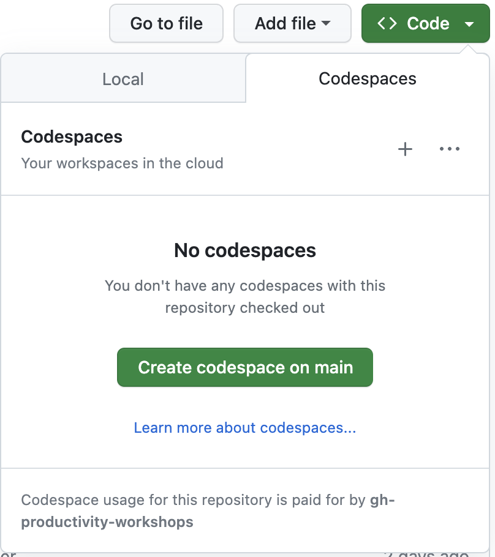

4. Click the ellipses (...) at the top of this window and choose `+ New with options...`

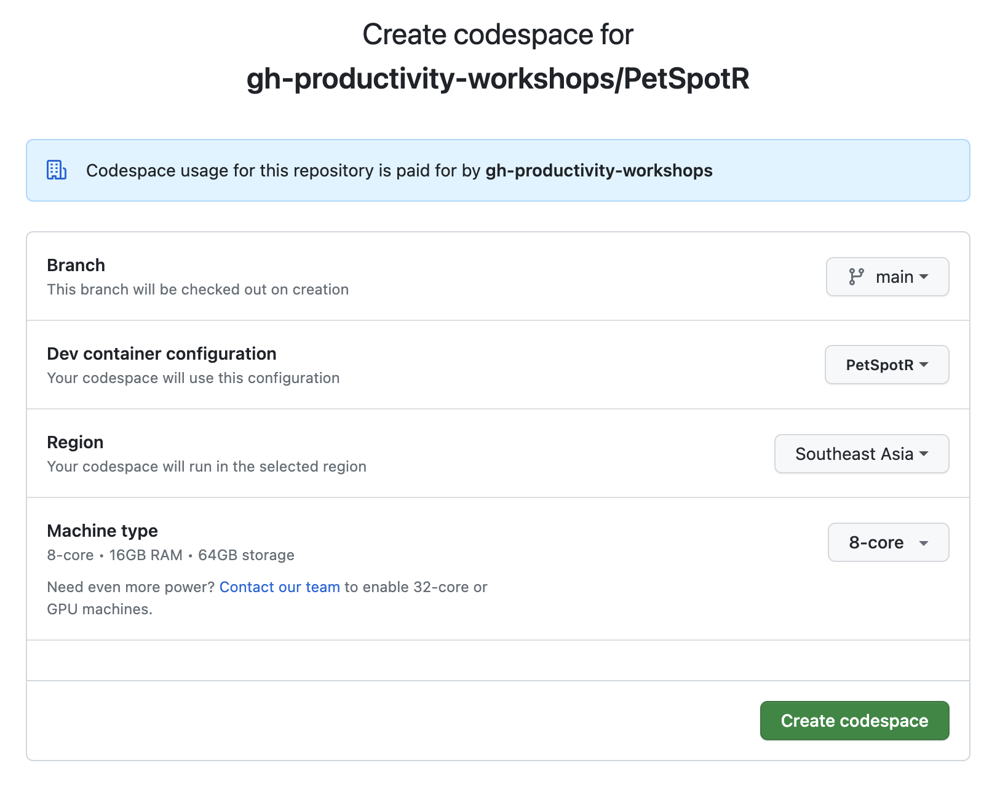

5. Click the dropdown for *Machine type* and look at the options. You'll note only one is available. This has been set as a policy by your organization admin!
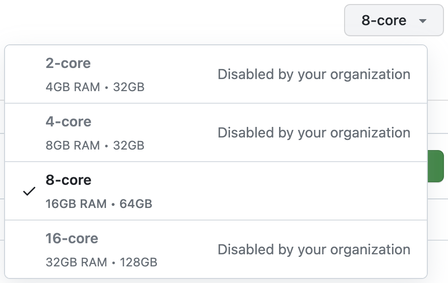

6. Click the "Create codespace" button, and watch your Codespace build

_Your instructor will talk about setting policies while you're waiting for your Codespace to spin up._

## 2. Run and Debug in a Codespace

1. Navigate to the Run and Debug pane (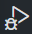)

2. Ensure the dropdown at the top is set to the "✅ Debug with Dapr" configuration and click the green play button.


_Both the backend and frontend components of your application should start up along with a number of other services. This may take up to a minute or more. When running, you can see which processes are being debugged using the dropdown._

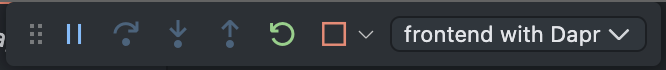

3. Navigate to the Ports pane at the bottom of the editor and see the ports that have been opened to expose the running components. There will be about 10.
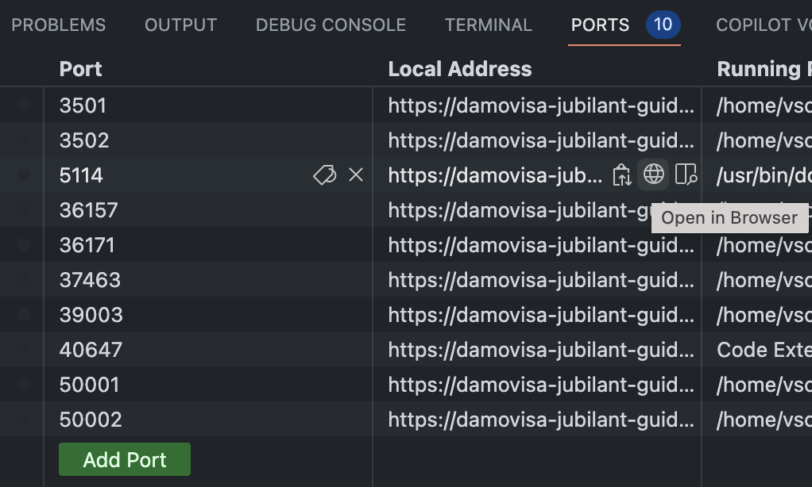

_You can change the visibility of these ports - opening them up to others in your org or even make them public._

4. Hover over the Local Address for port 5114, then click the "Open in Browser" icon () to open your app in a browser.

5. Go back to the Explorer pane (), then find and open `src/backend/app.py`. 

6. Put a breakpoint on line 45 (`print(f'Pet state retrieved', flush=True)`)

7. In the application running in your browser, go to *I lost my pet* and fill out the form. You can use any image on your machine, we don't actually process them!

8. In your Codespaces browser tab, notice the breakpoint has been hit! You can examine the `data` object right in VSCode in your browser.
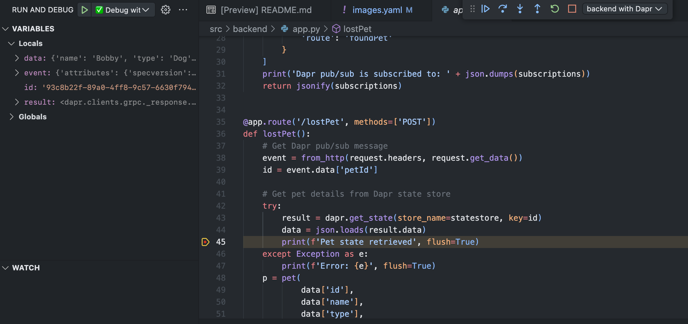

8. Stop the running debuggers by clicking the Stop button in the debugging pane. You'll need to do this twice - once for each running process.


## 3. Specifying what a Codespace needs

In the Explorer pane, open the `.devcontainer/devcontainer.json` file and explore. Focus on the following:
  - `image` - this is the docker image the Codespace uses. You can also use your own dockerfile, or have a docker compose file for multi-stage builds.
  - `onCreateCommand` - this lets us run our own scripts when the Codespace is created. There's also `postCreateCommand` if you need to wait until everything is otherwise ready to go.
  - `features` - this is the easiest way to add broader features to your Codespace. In our case we've added python and docker-in-docker (which allows us to run multiple containers inside our Codespace!). You can find out more at https://containers.dev/features
  - `customizations.vscode.extensions` - These are the extensions you want VSCode to have when you start a Codespace.

If you change the devcontainer in your Codespace, you can rebuild and see the changes (we'll do this in a minute). But if you commit and push to your repository, every Codespace created after that point by anyone can use this devcontainer specification.

You can also have multiple devcontainers and choose which to use for your Codespace. You may have seen that option when we created our Codespace right at the start.

## 4. Making a devcontainer change

Now that you're up and running with your Codespace, let's get ready to use GitHub Copilot!

Let's add the GitHub Copilot extension, but let's add it to the devcontainer rather than just install it.

1. Open the "Extensions" () pane

2. Search for "Copilot" and select the GitHub Copilot extension


3. Don't click the green "Install in Codespaces" button! Instead, click the cog icon (⚙️) and select "Add to devcontainer.json".
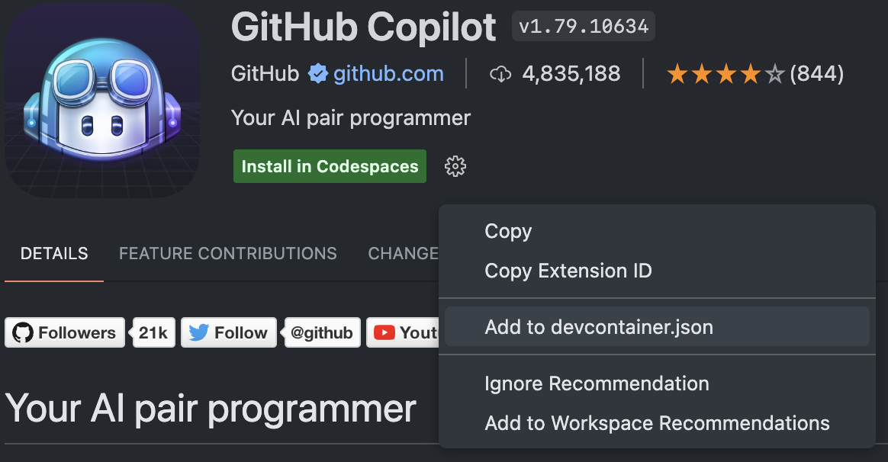

4. Go back to the `devcontainer.json` file and see the change. Note that the extension hasn't been installed in your Codespace at this point.
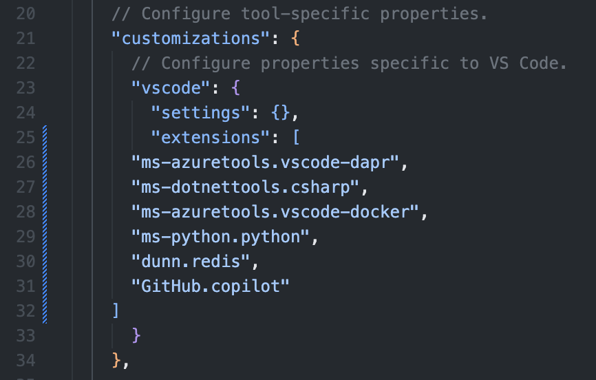

_To see the change, we'll need to rebuild our Codespace._

6. Using your keyboard, press `Ctrl/Cmd-Shift-P`, then type "rebuild" to find the "Codespaces: Rebuild Container" option. Select it and press Enter, or click it with the mouse.
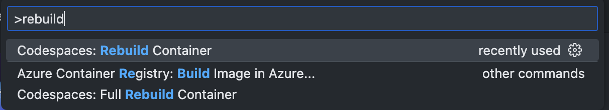

7. Confirm your choice by clicking "Rebuild" and wait for your Codespace to reload.
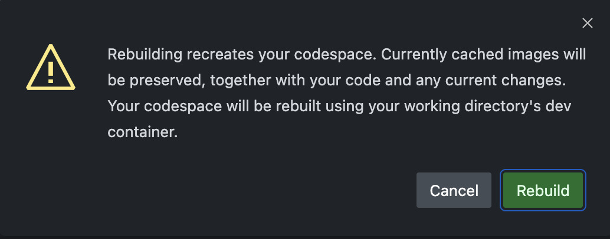

 _This may take a little longer than your first build! This is because we're taking advantage of a feature called Prebuilds. Your instructor will show you how to set these up and explain why they're useful._

8. Once reloaded, you'll be able to see GitHub Copilot installed - both in the Extensions pane, as well as via the GitHub Copilot logo at the bottom right of the status bar!


## 5. Add to the Lost Pet form using GitHub Copilot

Let's add some more details to our lost pets form. We want to also track where the pet was last seen. Let's take a look at the Lost Pet page.

_⚠️ NOTE: GitHub Copilot is non-deterministic! It syntheses code just for you, so you will likely see different suggestions than the person next to you! We'll talk about how to get the best out of Copilot a little later._

1. In the Explorer pane, Go to the `LostPet.razor` file (you can get there quickly with `Ctrl/Cmd-P`, then typing the filename)

2. Ensure GitHub Copilot is turned on using the icon at the right of the status bar. You can click this icon to turn GitHub Copilot on or off.


3. Go to line 50 and add a new line after the `</div>` but before `@if (isLoading)`

4. Type the following HTML comment explaining what we want to do next. It's a great prompt to help GitHub Copilot help us!

```<!-- Step 2.5 - pet's last location h2 element followed by a dropdown -->```

5. Press Enter to go to the next line.

6. GitHub Copilot should make a suggestion in grey with an `h2` heading. Hit `Tab` to accept the suggestion.
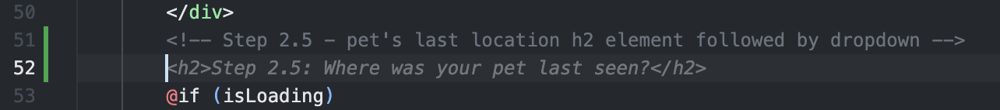

_🤔 We refer to this suggestion mechanism as "ghost text". You can hit Tab to accept a suggestion, or simply ignore it and keep typing._

7. On the next line, write the following comment and hit Enter.

```<!-- Dropdown menu with location -->```

8. GitHub Copilot should suggest an HTML dropdown with several locations
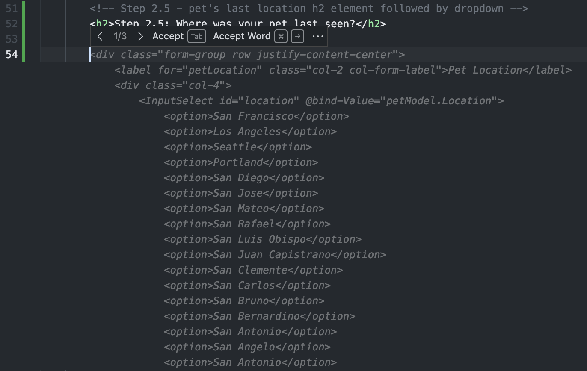

_In this case, GitHub Copilot was helpful, but they're not the cities we need, so let's provide more context._

9. Go back and Update the comment to the below, replacing [your city] with the name of your city and hit Enter again.

 ```<!-- Dropdown menu with 5 locations in [your city] -->```

10.  GitHub Copilot should make some more accurate suggestions. Hit Tab to accept.
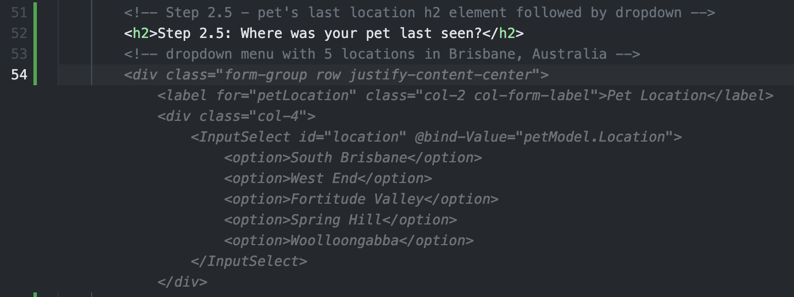

11.  Make further changes to ensure the HTML is valid and all `div` elements are closed. You may need to make some small modifications and GitHub Copilot is likely to help here as well.

## 6. Add to the PetModel

You might notice that there's no `Location` field in `PetModel` (the red squiggles show there's an error), so let's fix that.
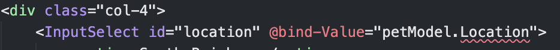

1. Use `Ctrl/Cmd-P` to search for `PetModel.cs` and open that file.

2. Add a new line after line 13 (`public List<string> Images { get; set; }`)

3. Add `public string Location { get; set; }`. GitHub Copilot may start helping you at some point, but if not, don't worry, just keep typing!

4. Add a new line after line 25 (`Images = new();`). GitHub Copilot will almost certainly fill in what we need (`Location = "";`), so hit Tab to accept.
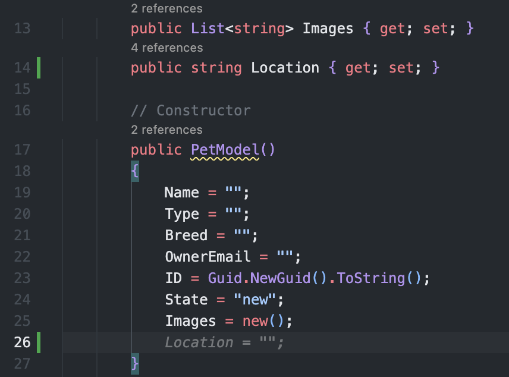

## 7. Let's run to see our changes

Now we've made some changes with the help of GitHub Copilot, let's see the results!

1. Ensure you've saved the files you've edited. You can do this by pressing CTRL+S on the keyboard.

2. Navigate to the "Run and Debug" pane () and use the "✅ Debug with Dapr" configuration again to debug.

3. Again, open the application by clicking on the "Open in Browser" icon () in the Ports pane.

3. Go to the "I lost my pet" page and you should see your changes.
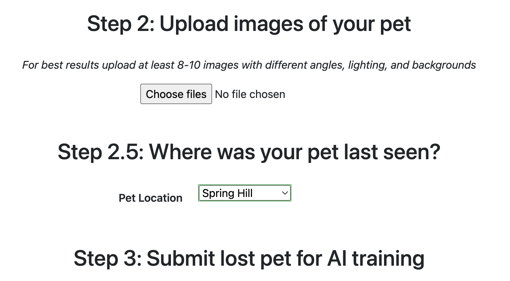

## OPTIONAL (time dependent) Back end changes

If there's time during the workshop, or you're ahead of the class, try out this optional step.

So far we've only made front-end changes and the extra data won't persist in the backend. See if you can use GitHub Copilot to help you make backend changes as well!

_🔎 Hint: look for where to add details about the pet's last known location in `petspotr.py` and `app.py`_

## 8. Use GitHub Copilot to write tests

Finally, we're going to use GitHub Copilot to help us write some tests around our pages. This application already uses Playwright for testing, so let's build on that.

1. In the `src/tests/playwright/tests` folder, create a new file called `lostpage.spec.ts`
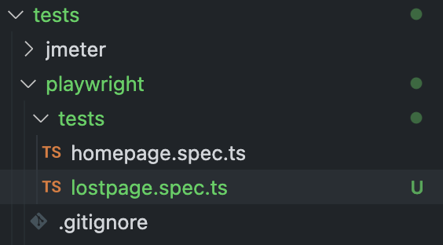

2. In that file, write a comment that says:

```// create playwright tests for LostPet.razor```

_ℹ️  Note that you should leave the LostPet.razor file open in VSCode so you're providing better context!_

_GitHub Copilot uses other open files to construct useful information to send back to the server. This "prompt crafting" can make a big difference in the results you'll get._

3. On the next line, write the following comment and hit Enter

```// import dependencies```

4. GitHub Copilot should suggest something like `import { test, expect } from @playwright/test`. If this doesn't work, try opening another test file for better context.

5. Write the comment below and hit Enter. 

```// test that h2 element with the words "Step 1: Tell us about your pet and how to contact you" renders```

_GitHub Copilot should do a good job of giving you the test function, although it may give it to you line by line. Hit Tab to accept until you're happy._

7. Write a comment that with the following and hit Enter

```// test that dropdown menu renders```

8. GitHub Copilot again should do a good job - it may even suggest looking for `Dog` in the dropdown!

9. Finally, try adding the comment below and hitting Enter.

```// test that you can upload images when you click Choose Files button```

_😖 Note that last one is more temperamental and might need extra prompting. You should end up with something similar to the following._
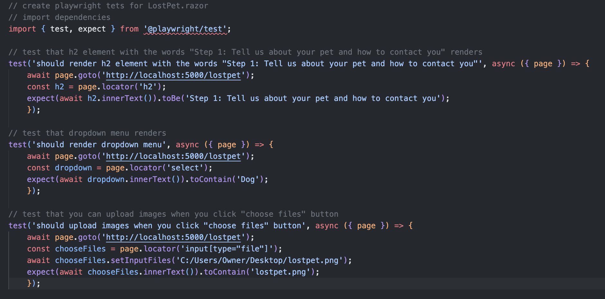

# 🥳 Congratulations!

 Great work! You've completed the workshop. You've learned how to use Codespaces and GitHub Copilot to improve your productivity as a developer.

In a very short time, you have:
1. Been able to edit and debug a brand new application with several moving parts and a collection of frameworks and technologies. All within a few minutes!
2. Seen how you can customize that cloud-based developer environment to minimize onboarding time, let you work from anywhere, and provide consistency for your team
3. Used GitHub Copilot to help create a new feature for your application.
4. Used GitHub Copilot to help you write tests - possibly using a framework you were previously unfamiliar with!

Of course it's impossible to learn everything about these features in a short workshop, but we hope you've learned enough to see the power of these technologies and how it can improve your productivity and day-to-day happiness.

# Taking this home with you

This repository is public, so once you've finished the workshop, you can always come back and do it again, or share it with your colleagues!

If you're not a current user of Codespaces or Copilot, you can use up to [60 hours of free Codespaces access a month](https://github.com/features/codespaces#pricing), and sign up for a [free GitHub Copilot trial](https://github.com/github-copilot/signup).